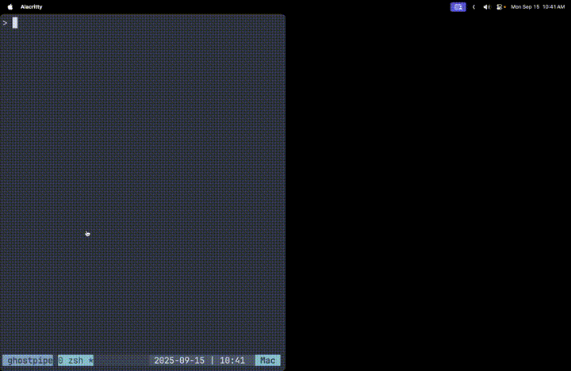

# Ghostpipe OpenAPI

Swagger UI with [Ghostpipe](https://github.com/inputlogic/ghostpipe) support.



## Setup

```bash
npm install
npm run dev
```

## Usage

(Assuming your openapi spec is in openapi.yml)

`ghostpipe http://localhost:5173 openapi.yml`

Open http://localhost:5173 to view the interactive API documentation.
